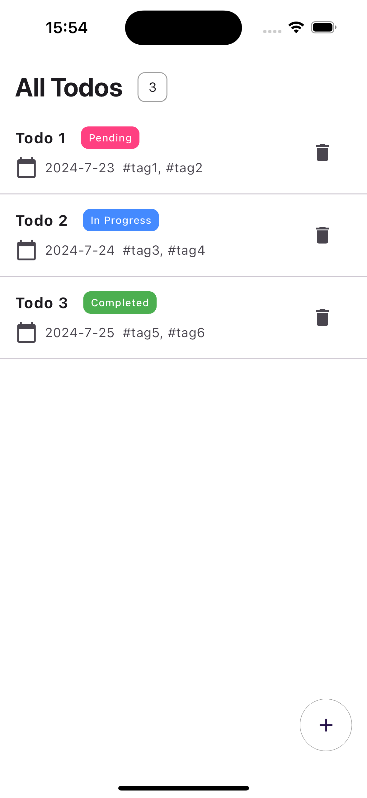
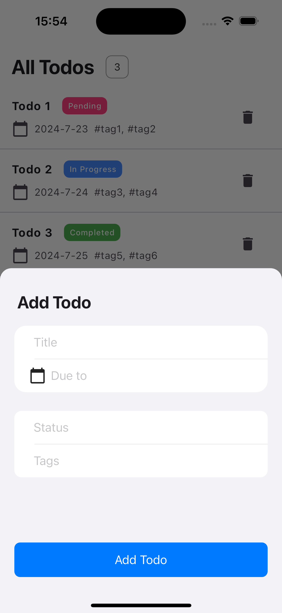

# KWS iOS Team Coding Test
Thank you for your time to work on this coding test.

## What to do
- Implement the iOS native application described below
- Make the application runnable locally
- Use SwiftUI and TCA, and SwiftData
- Use the provided API server to fetch data
- Add the testing code to meet the requirements

- **Be sure to write code that sufficiently demonstrates design patterns and architecture. You are expected to utilize your senior-level knowledge of software development to the best of your ability.**
- **The code you write needs to be well explained.**
- **When creating your UI, the screenshots provided are just a reference. You are encouraged to follow the HIG, point out any issues with the UI in the screenshots, and choose a suitable design.**

- Display all ToDo items on the page fetched by GET /todos API.
- Display each item's title, status, deadline, and tags, like the above image.
- Display the delete button for each item that allows users to delete the item.
- Display the item counts like in the above image.
- Display the button to add a new ToDo item as a floating action button.  

Please display the Bottom sheet to add a new ToDo.  

- Call POST /todos API with the form values when clicking on the Add Todo button.
- Display a new ToDo item after receiving the POST /todos API response.
- Please use system icons of iOS. You can choose proper one on your own.
- These images are for reference purposes only. Please be sure to utilize your knowledge of the Human Interface Guidelines to design and implement the user interaction.
- Additionally, please provide a rationale and explanation for your design in comments within your code.

If you have something else you'd like to see developed, feel free to add it!
(But please explain the details.)

## How to submit your implementation
- Create a pull request to the provided repository
- After creating the pull request, please let us know by email.
